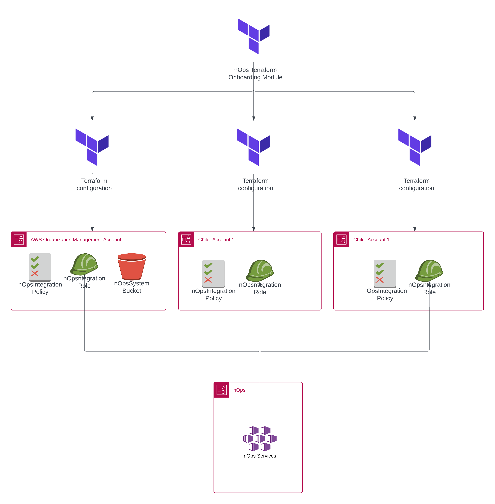

# nOps AWS Integration Terraform Module

## Description

This Terraform module automates the process of integrating your AWS account with nOps, a cloud management and optimization platform. It streamlines the setup of necessary AWS resources and permissions, enhancing the onboarding experience for nOps users.



## Features

- Automatic detection of existing nOps projects for the AWS account
- Creation of new nOps projects if none exist
- Handling of master and member AWS accounts
- Automatic setup of IAM roles and policies for nOps integration
- S3 bucket creation and configuration for master accounts
- Integration with nOps API for secure token exchange

## Prerequisites

- Terraform v1.0+
- AWS CLI configured with appropriate permissions
- nOps API key

## Minimum required IAM permissions
The following list contains the base IAM permissions required by the `nOps` platform to perform
the base actions on customer accounts.

| Base permissions required                              |
|--------------------------------------------------------|
| `autoscaling:DescribeAutoScalingGroups`                |
| `autoscaling:DescribeAutoScalingInstances`             |
| `autoscaling:DescribeLaunchConfigurations `            |
| `ce:GetCostAndUsage`                                   |
| `ce:GetReservationPurchaseRecommendation`              |
| `ce:GetReservationUtilization`                         |
| `ce:GetSavingsPlansUtilizationDetails`                 |
| `ce:ListCostAllocationTags`                            |
| `ce:StartSavingsPlansPurchaseRecommendationGeneration` |
| `ce:UpdateCostAllocationTagsStatus`                    |
| `ce:GetSavingsPlansPurchaseRecommendation`             |
| `cloudformation:DescribeStacks`                        |
| `cloudformation:ListStacks`                            |
| `cloudtrail:DescribeTrails`                            |
| `cloudtrail:LookupEvents`                              |
| `cloudwatch:GetMetricStatistics`                       |
| `cloudwatch:ListMetrics`                               |
| `config:DescribeConfigurationRecorders`                |
| `cur:DescribeReportDefinitions`                        |
| `cur:PutReportDefinition`                              |
| `dynamodb:DescribeTable`                               |
| `dynamodb:ListTables`                                  |
| `ec2:DescribeAvailabilityZones`                        |
| `ec2:DescribeFlowLogs`                                 |
| `ec2:DescribeImages`                                   |
| `ec2:DescribeInstances`                                |
| `ec2:DescribeInstanceStatus`                           |
| `ec2:DescribeLaunchConfigurations`                     |
| `ec2:DescribeLaunchTemplateVersions`                   |
| `ec2:DescribeNatGateways`                              |
| `ec2:DescribeNetworkInterfaces`                        |
| `ec2:DescribeRegions`                                  |
| `ec2:DescribeReservedInstances`                        |
| `ec2:DescribeRouteTables`                              |
| `ec2:DescribeSecurityGroups`                           |
| `ec2:DescribeSnapshots`                                |
| `ec2:DescribeVolumes`                                  |
| `ec2:DescribeVpcs`                                     |
| `ecs:ListClusters`                                     |
| `eks:DescribeCluster`                                  |
| `eks:DescribeNodegroup`                                |
| `eks:ListClusters`                                     |
| `elasticache:DescribeCacheClusters`                    |
| `elasticache:DescribeCacheSubnetGroups`                |
| `elasticfilesystem:DescribeFileSystems`                |
| `elasticloadbalancing:DescribeLoadBalancers`           |
| `es:DescribeElasticsearchDomains`                      |
| `es:ListDomainNames`                                   |
| `events:CreateEventBus`                                 |
| `events:ListRules`                                      |
| `guardduty:ListDetectors`                               |
| `iam:GetAccountPasswordPolicy`                          |
| `iam:GetAccountSummary`                                 |
| `iam:GetRole`                                           |
| `iam:ListAttachedUserPolicies`                          |
| `iam:ListRoles`                                         |
| `iam:ListUsers`                                         |
| `inspector:ListAssessmentRuns`                          |
| `kms:Decrypt`                                           |
| `lambda:GetFunction`                                    |
| `lambda:GetPolicy`                                      |
| `lambda:InvokeFunction`                                 |
| `lambda:ListFunctions`                                  |
| `organizations:DescribeOrganization`                    |
| `organizations:InviteAccountToOrganization`             |
| `organizations:ListAccounts`                            |
| `organizations:ListRoots`                               |
| `rds:DescribeDBClusters`                                |
| `rds:DescribeDBInstances`                               |
| `rds:DescribeDBSnapshots`                               |
| `redshift:DescribeClusters`                             |
| `s3:ListAllMyBuckets`                                    |
| `savingsplans:DescribeSavingsPlans`                      |
| `support:DescribeCases`                                  |
| `support:DescribeTrustedAdvisorCheckRefreshStatuses`     |
| `support:DescribeTrustedAdvisorCheckResult`              |
| `support:DescribeTrustedAdvisorChecks`                   |
| `tag:GetResources`                                       |
| `wellarchitected:ListLenses`                             |
| `wellarchitected:ListWorkloads`                          |
| `workspaces:DescribeWorkspaceDirectories`                |

## Usage

### Onboarding Payer account

The below example shows how to add the management (root) AWS account integration:


1. Being authenticated on the Payer account of the AWS organization, add the following code:
```hcl
provider "aws" {
  alias  = "root"
  region = "us-east-1"
  assume_role {
    role_arn = "arn:aws:iam::123456789012:role/admin-role"
  }
}

module tf_onboarding {
  providers = {
    aws = aws.root
  }
  source             = "nops-io/nops-integration/aws"
  # nOps API key that will be used to authenticate with the nOps platform to onboard the account.
  api_key            = "nops_api_key"
}
```

2. Initialize Terraform:

```
terraform init
```

3. Plan and apply the Terraform configuration:

```
terraform plan -out=plan

terraform apply plan
```

If you want to reconfigure an existing nOps account:

```
terraform apply plan -var="reconfigure=true"
```

or

```hcl
module tf_onboarding {
  providers = {
    aws = aws.root
  }

  source             = "nops-io/nops-integration/aws"
  system_bucket_name = "example"
  api_key            = "nops_api_key"
  reconfigure        = true
}
```

4. Troubleshooting

If you want to reinstall the stack you might get an error

```
│ Error: creating IAM Role (NopsIntegrationRole-xxxxx): EntityAlreadyExists: Role with name NopsIntegrationRole-xxxxx already exists.
```

You can import the role to terraform state by running the following command
```
terraform import module.tf_onboarding.aws_iam_role.nops_integration_role NopsIntegrationRole-xxxxx
```

If the above yields the following error
```
│ Error: Resource already managed by Terraform
│
│ Terraform is already managing a remote object for aws_iam_role.nops_integration_role. To import to this address you must first remove the existing object from the state.
```

Then execute the following command to remove the failed resource from the state, and then import
```
terraform state rm module.tf_onboarding.aws_iam_role.nops_integration_role
```

### Onboarding child account

Onboarding child accounts is performed using the same module, it already contains the logic to react when its being applied on any account that is not root
```hcl
provider "aws" {
  alias  = "child"
  region = "us-east-1"
  assume_role {
    role_arn = "arn:aws:iam::xxxxxxxx:role/admin-role"
  }
}

module tf_onboarding {
  providers = {
    aws = aws.child
  }

  source             = "nops-io/nops-integration/aws"
  # nOps API key that will be used to authenticate with the nOps platform to onboard the account.
  api_key            = "nops_api_key"
}
```

<!-- BEGIN_TF_DOCS -->
## Requirements

| Name | Version |
|------|---------|
| <a name="requirement_terraform"></a> [terraform](#requirement\_terraform) | >= 1.0 |
| <a name="requirement_aws"></a> [aws](#requirement\_aws) | ~> 4.0 |
| <a name="requirement_http"></a> [http](#requirement\_http) | ~> 3.0 |
| <a name="requirement_null"></a> [null](#requirement\_null) | 3.2.3 |
| <a name="requirement_time"></a> [time](#requirement\_time) | ~> 0.7 |

## Providers

| Name | Version |
|------|---------|
| <a name="provider_aws"></a> [aws](#provider\_aws) | ~> 4.0 |
| <a name="provider_http"></a> [http](#provider\_http) | ~> 3.0 |
| <a name="provider_time"></a> [time](#provider\_time) | ~> 0.7 |

## Modules

No modules.

## Resources

| Name | Type |
|------|------|
| [aws_iam_role.nops_integration_role](https://registry.terraform.io/providers/hashicorp/aws/latest/docs/resources/iam_role) | resource |
| [aws_iam_role_policy.nops_compute_copilot_policy](https://registry.terraform.io/providers/hashicorp/aws/latest/docs/resources/iam_role_policy) | resource |
| [aws_iam_role_policy.nops_essentials_policy](https://registry.terraform.io/providers/hashicorp/aws/latest/docs/resources/iam_role_policy) | resource |
| [aws_iam_role_policy.nops_integration_policy](https://registry.terraform.io/providers/hashicorp/aws/latest/docs/resources/iam_role_policy) | resource |
| [aws_iam_role_policy.nops_system_bucket_policy](https://registry.terraform.io/providers/hashicorp/aws/latest/docs/resources/iam_role_policy) | resource |
| [aws_iam_role_policy.nops_wafr_policy](https://registry.terraform.io/providers/hashicorp/aws/latest/docs/resources/iam_role_policy) | resource |
| [aws_s3_bucket.nops_system_bucket](https://registry.terraform.io/providers/hashicorp/aws/latest/docs/resources/s3_bucket) | resource |
| [aws_s3_bucket_policy.nops_bucket_policy](https://registry.terraform.io/providers/hashicorp/aws/latest/docs/resources/s3_bucket_policy) | resource |
| [aws_s3_bucket_public_access_block.nops_bucket_block_public_access](https://registry.terraform.io/providers/hashicorp/aws/latest/docs/resources/s3_bucket_public_access_block) | resource |
| [aws_s3_bucket_server_side_encryption_configuration.nops_bucket_encryption](https://registry.terraform.io/providers/hashicorp/aws/latest/docs/resources/s3_bucket_server_side_encryption_configuration) | resource |
| [time_sleep.wait_for_resources](https://registry.terraform.io/providers/hashicorp/time/latest/docs/resources/sleep) | resource |
| [aws_caller_identity.current](https://registry.terraform.io/providers/hashicorp/aws/latest/docs/data-sources/caller_identity) | data source |
| [aws_organizations_organization.current](https://registry.terraform.io/providers/hashicorp/aws/latest/docs/data-sources/organizations_organization) | data source |
| [http_http.check_current_client](https://registry.terraform.io/providers/hashicorp/http/latest/docs/data-sources/http) | data source |
| [http_http.check_project_aws](https://registry.terraform.io/providers/hashicorp/http/latest/docs/data-sources/http) | data source |
| [http_http.create_nops_project](https://registry.terraform.io/providers/hashicorp/http/latest/docs/data-sources/http) | data source |
| [http_http.notify_nops_integration_complete](https://registry.terraform.io/providers/hashicorp/http/latest/docs/data-sources/http) | data source |

## Inputs

| Name | Description | Type | Default | Required |
|------|-------------|------|---------|:--------:|
| <a name="input_api_key"></a> [api\_key](#input\_api\_key) | The nOps API key | `string` | n/a | yes |
| <a name="input_compute_copilot"></a> [compute\_copilot](#input\_compute\_copilot) | If true, the IAM policy required for nOps compute copilot will be created. | `bool` | `true` | no |
| <a name="input_essentials"></a> [essentials](#input\_essentials) | If true, the IAM policy required for nOps essentials will be created. | `bool` | `true` | no |
| <a name="input_reconfigure"></a> [reconfigure](#input\_reconfigure) | [DEPRECATED] If true, allows overriding existing project settings. If false, stops execution if project already exists. | `bool` | `false` | no |
| <a name="input_wafr"></a> [wafr](#input\_wafr) | If true, the IAM policy required for nOps WAFR will be created. | `bool` | `true` | no |

## Outputs

| Name | Description |
|------|-------------|
| <a name="output_current_client_id"></a> [current\_client\_id](#output\_current\_client\_id) | The client ID of the current account in nOps |
| <a name="output_is_master_account"></a> [is\_master\_account](#output\_is\_master\_account) | Whether the current account is the master account |
| <a name="output_is_master_account_out"></a> [is\_master\_account\_out](#output\_is\_master\_account\_out) | Indicates if the account is the master account |
| <a name="output_master_account_id"></a> [master\_account\_id](#output\_master\_account\_id) | The account ID of the AWS Organization's master account |
| <a name="output_nops_integration_status"></a> [nops\_integration\_status](#output\_nops\_integration\_status) | Indicates if the nOps integration notification was sent |
| <a name="output_notify_nops_integration_complete_status"></a> [notify\_nops\_integration\_complete\_status](#output\_notify\_nops\_integration\_complete\_status) | Status of the nOps integration notification |
| <a name="output_project_aws_list"></a> [project\_aws\_list](#output\_project\_aws\_list) | List of projects in nOps |
| <a name="output_project_status"></a> [project\_status](#output\_project\_status) | Status of the nOps project for this account |
| <a name="output_role_arn"></a> [role\_arn](#output\_role\_arn) | The ARN of the IAM role |
| <a name="output_system_bucket_name"></a> [system\_bucket\_name](#output\_system\_bucket\_name) | The name of the S3 bucket (if created) |
<!-- END_TF_DOCS -->
